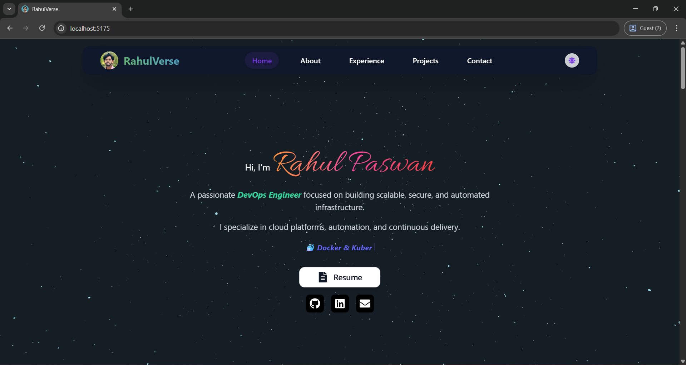

# 🚀 RahulVerse - DevOps Engineer Portfolio 🌐

Welcome to my personal portfolio! I'm **Rahul Paswan**, a passionate **DevOps Engineer** with expertise in **Cloud Computing**, **Automation**, **CI/CD**, and **Infrastructure as Code**. This portfolio is a showcase of my work, skills, and achievements in the tech world. Feel free to explore and connect with me! 🌟

---

## 📋 Table of Contents
1. [Features](#features)
2. [Tech Stack](#tech-stack)
3. [Installation](#installation)
4. [Usage](#usage)
5. [Environment Variables](#environment-variables)
6. [Live Demo / Screenshots](#live-demo--portfolio-screenshots)
7. [Contact](#contact)
8. [License](#license)

---

## ✨ Features

- 🎨 **Dynamic Design**: Beautiful UI built with React + TailwindCSS.
- 🌟 **Typewriter Effect**: Rotating text animation showcasing key DevOps skills.
- 🌙 **Dark/Light Mode**: Toggle between themes for a personalized experience.
- 🌌 **Animated 3D Background**: Custom animated stars using React Three Fiber.
- 📱 **Responsive Design**: Optimized for all screen sizes.
- 📬 **Email Contact Form**: Send emails directly using **EmailJS**.
- 📚 **Project Showcase**: Highlight of key DevOps projects with images and links.

---

## 🛠️ Tech Stack

| Frontend       | Animation / Visuals      | DevOps / Backend    | Tools / Others        |
|----------------|--------------------------|---------------------|-----------------------|
| React ⚛️       | React Three Fiber 🌌    | EmailJS 📬          | Vite ⚡              |
| HTML5 / CSS3   | Typewriter Effect ✍️     | Docker 🐳          | ESLint / Prettier ✅  |
| TailwindCSS 🎨 | Framer Motion 🎞️        | GitHub Actions ⚙️   | React Icons 🎯       |

---

## 🚀 Installation

To get a local copy of this project up and running:

```bash
# 1️⃣ Clone the repo
git clone https://github.com/Rahul-Kumar-Paswan/portfolio

# 2️⃣ Navigate into the project directory
cd portfolio

# 3️⃣ Install dependencies
npm install

# 4️⃣ Start development server
npm run dev
```
🚀 Your app should now be running at: [http://localhost:5175](http://localhost:5175)

## 💻 Usage

Open your browser and go to the project URL (usually localhost:3000).
The portfolio is divided into different sections: Home, About, Experience, Projects, and Contact.
You can toggle between dark and light themes using the theme button in the navigation bar.
View detailed descriptions and demos for each of the projects I have worked on.
The Contact section contains a contact form, allowing visitors to send an email directly to me using EmailJS.

## 📝 Environment Variables

To enable the EmailJS integration, create a .env file in the root of your project with the following keys:
```bash
VITE_EMAILJS_SERVICE_ID=your_service_id
VITE_EMAILJS_TEMPLATE_ID=your_template_id
VITE_EMAILJS_PUBLIC_KEY=your_public_key
```
🔒 Never commit .env files to GitHub!

## 🔗 Live Demo / Portfolio Screenshots

🔴 Live URL: https://rahulverse.com

### 🖼️ Screenshots:
> ⚠️ Screenshots coming soon!  
  
_For more UI pages, check the [`/screenshots`](./screenshots) folder._

## 📬 Contact

- 🐱 GitHub: [Rahul's GitHub](https://github.com/Rahul-Kumar-Paswan/)
- 💼 LinkedIn: [Rahul's LinkedIn](https://www.linkedin.com/in/rahul-paswan-b1b57b227)
- 📧 Email: [Email Me](mailto:rahulkumarpaswan941@gmail.com)
- 📄 Resume: [Download My Resume](public/Rahul_Paswan_Resume.pdf)


## 📜 License
MIT License © 2025 Rahul Paswan
This project is licensed under the [MIT License](./LICENSE).